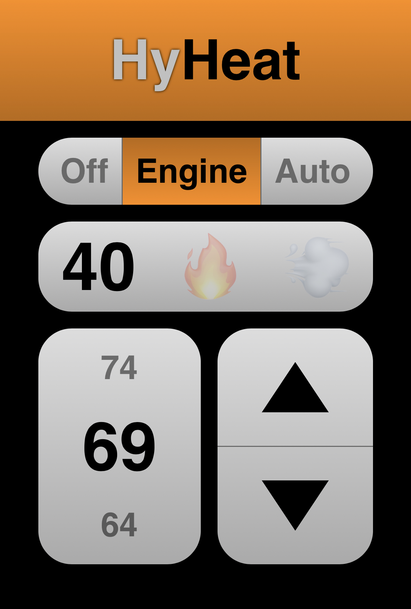

# HyHeat
ESP32-based thermostat for RVs with a hydronic furnace in line with the engine.

## Main Features
* Automatically start and stop hydronic furnace.
* Ensure minimum furnace runtimes.
* Configurable hysteresis.
* Automatically leverage "free" waste engine heat, with optional overshoot.
* Web interface.
* Stats push via UDP.
* OTA firmware updates.

## Hardware
You'll need an ESP32 connected up to two relays and two DHT22 temperature sensors. This project has been tested with [such a board](https://www.amazon.com/dp/B0B8J9SNB5).

### Temperature Sensors
The `main` temperature sensor is used for general comfort readings. It should be placed somewhere in the living/sleeping quarters that is outside direct path of heating elements.

The `heater` temperature sensor is used for detecting the availability of "free" engine heat.

### Relays
The `furnace` relay is used for turning on and off the hydronic furnace. It is assumed that the relay should flip on, and stay on, for the duration of the furnace burn when called for, and that the furnace hardware will automatically run the fan when burning.

The `fan` relay is used for turning on and off the heater matrix fan separate from the furnace, in order to use "free" waste engine heat.

## Configuration
Macros for configuration must be defined in `src/config.h`. An example configuration can be copied from `src/config.example.h`.