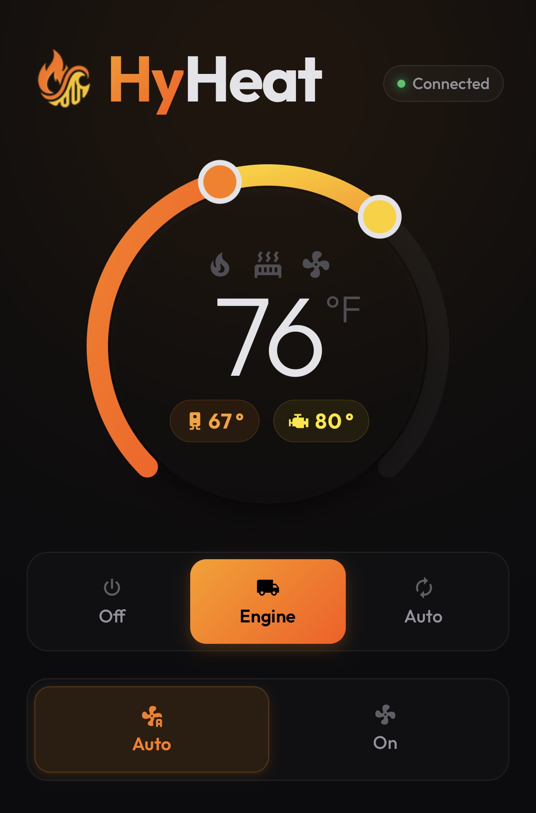

#  HyHeat 

**HyHeat** is a premium, state-of-the-art ESP32-based smart thermostat system designed specifically for campervans and RVs equipped with a hydronic furnace (e.g., Webasto, Eberspächer, or Aqua-Hot) plumbed in line with the engine's coolant loop. 

By utilizing dual-thermostat climate logic, HyHeat seamlessly harvests "free" waste engine heat while driving or hot-camping, automatically transitioning back to the combustion furnace only when needed. It hosts a gorgeous, glassmorphic **Progressive Web App (PWA)** directly from the ESP32's flash storage, allowing full-screen offline-capable dashboard control on mobile phones or tablets.

<div align="center">
  
</div>

---

## 🌟 Key Features

*   **Dual-Thermostat Logic**:
    *   **Engine Heat Thermostat**: Actively monitors the engine coolant loop. When coolant is hot (e.g., above 55°C), it leverages this "free" waste heat by running only the matrix fan, allowing a configurable cabin temperature overshoot to store thermal energy.
    *   **Furnace Thermostat**: Safely fires up the hydronic combustion furnace and matrix fan when waste engine heat is unavailable.
*   **Equipment Protection & Safety**:
    *   Strict configurable minimum runtimes (e.g., 15 minutes for the furnace to prevent short-cycling and carbon build-up).
    *   Configurable hysteresis/deadbands and overrun values to minimize relay chatter.
*   **Self-Healing Sensor Health Check**:
    *   Dedicated automated interval checks monitor temperature readings.
    *   If a sensor bus lockup or `NaN` reading is detected for 10 consecutive cycles (100 seconds), a dedicated power GPIO pin performs a hard power-cycle of the sensor bus to automatically recover.
*   **Luxury Glassmorphic PWA Web Interface**:
    *   Served directly from the ESP32 via a custom high-performance `html_host` ESPHome component.
    *   Premium Outfit typography, fluid interactive double-handle temperature dial, SVG-rendered active glows, and hardware-accelerated animations.
    *   Fully installable PWA with full-screen standalone capability, custom assets, service worker caching, and theme styling.
*   **Real-time UDP Telemetry**:
    *   Pushes InfluxDB line-protocol statistics via UDP for instant Grafana/InfluxDB dashboard visualization.
    *   Tracks uptime, exact duty times for the fan and furnace, sensor readings, and setpoints.
    *   IP and port are dynamically configurable inside the web interface without re-flashing.
*   **OTA Firmware Updates**: Supported natively via ESPHome.

---

## 🔌 Hardware Architecture

HyHeat runs on an **ESP32 DevKit** board connected to two relays and two temperature sensors.

### 1. Temperature Sensors
*   **Cabin Sensor (DHT22)**: Placed in the living/sleeping quarters. Measures ambient cabin temperature and relative humidity. Powered via a GPIO-controlled transistor/switch to allow hard-reboots.
*   **Heater Loop Sensor (NTC Thermistor)**: Placed on the engine coolant line entering the interior heat exchanger. Calibrated via a standard voltage divider (upstream configuration, 2.2k ohm series resistor) using the native **Steinhart-Hart** converter filter.

### 2. Relays
*   **Furnace Relay**: Controls the hydronic furnace ignition line. Flipped on and kept on for the duration of the burn cycle.
*   **Fan Relay**: Powers the matrix heat-exchanger fan, allowing it to run independently when engine waste heat is harvested or in furnace-only mode.

### 3. GPIO Pinout (Default Configuration)

| Pin | Function | Description |
| :--- | :--- | :--- |
| **GPIO18** | Cabin Temp Input | Connected to the DHT22 data line |
| **GPIO34** | Heater Temp Input | ADC input connected to the NTC thermistor divider |
| **GPIO21** | Sensor Power | Controls VCC to the DHT22/thermistor for hardware reset |
| **GPIO16** | Furnace Relay | High triggers hydronic furnace burn |
| **GPIO17** | Fan Relay | High triggers matrix radiator fan |
| **GPIO23** | Status LED | System diagnostic LED indicator |

---

## 🛠️ ESPHome Configuration & Setup

HyHeat is built on a clean, modern ESPHome YAML definition leveraging custom external components.

### 1. File Structure
```bash
├── hyheat.yaml              # Core ESPHome configuration definitions
├── secrets.yaml             # Private credentials (WiFi, API keys, etc.)
├── LICENSE                  # MIT License
├── README.md                # This documentation
├── data/
│   └── htdocs/              # Static web interface files
│       ├── thermostat.html  # Main glassmorphic interface
│       ├── sw.js            # PWA service worker
│       ├── manifest.webmanifest # PWA configuration manifest
│       ├── apple-touch-icon.png # Generated app icon (192x192 transparent PNG)
│       └── favicon.ico      # Multi-resolution favicon bundle
└── components/
    └── html_host/           # Custom ESPHome component to host PWA assets
```

### 2. Configure `secrets.yaml`
Create a `secrets.yaml` file (copied from `secrets.yaml.example` if available) and fill in your network credentials:

```yaml
wifi_ssid: "Your_WiFi_SSID"
wifi_password: "Your_WiFi_Password"
api_encryption_key: "Generated_ESPHome_API_Key"
ota_password: "Your_OTA_Password"
```

### 3. Compile and Flash
Make sure you have ESPHome installed on your computer.

```bash
# Verify the configuration syntax is correct
esphome config hyheat.yaml

# Compile the firmware and upload it to your ESP32
esphome run hyheat.yaml
```

Once flashed, the ESP32 will connect to your WiFi network and host the web interface at `http://hyheat.local/thermostat` or via its assigned DHCP IP address.

---

## 💻 Web Interface & PWA Installation

The PWA is designed with a premium, mobile-first dashboard aesthetic:
*   **Dial Control**: The outer ring acts as a double-handle dial. Grab the **Orange handle** to adjust the Furnace Setpoint and the **Gold handle** to adjust the Engine Waste Heat Setpoint.
*   **Operating Modes**:
    *   **Off**: Turns all thermostats and demands off.
    *   **Engine**: Turns on only the Engine Heat Thermostat (runs fan using waste coolant heat).
    *   **Auto**: Standard smart thermostat operation. Runs the matrix fan on engine heat if coolant $>55^\circ\text{C}$; if coolant drops and cabin is cold, it fires up the furnace.
*   **Fan Mode**: Toggle between **Auto** (thermostat-controlled fanning) and **On** (continuous cabin air circulation).

### 📱 Installing on Mobile Devices (iOS & Android)
1.  Navigate to `http://hyheat.local/thermostat` in Safari (iOS) or Chrome (Android).
2.  Tap the **Share** button (iOS) or the **Menu** button (Android).
3.  Select **Add to Home Screen**.
4.  HyHeat will now appear on your device's home screen with the beautiful premium icon and run in standalone, full-screen mode like a native app.

---

## 📊 UDP Telemetry Payload

HyHeat sends real-time statistics in InfluxDB line-protocol format. The payload is constructed and optimized to fit into a single MTU:

```text
hyheat,host=HyHeat furnace_relay=F,fan_relay=T,fan_override=F,has_residual_heat=T,engine_thermostat_on=T,furnace_thermostat_on=T,uptime=3624i,fan_on_s=120i,furnace_on_s=0i,cabin_temp=21.4,cabin_humidity=42.1,heater_loop_temp=62.8,furnace_target_temp=19.0,engine_target_temp=24.0,min_residual_heat=55.0
```

You can point these logs to a UDP listener in InfluxDB (port `8089` by default) to build dashboards monitoring fuel efficiency, heating duties, and temperature curves in real time.